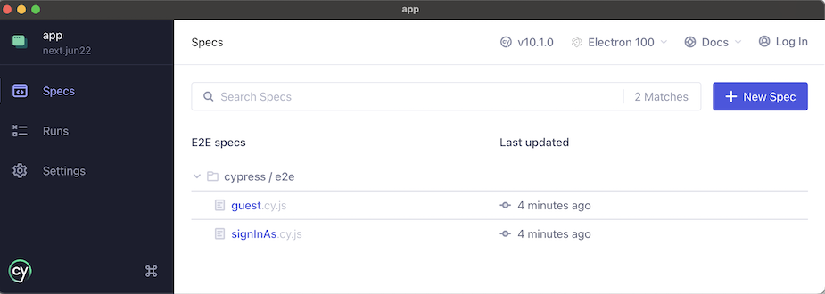

# App

Web application sample project.

## Requirements

- `npm`
- Java runtime environment (JRE), needed by Firebase emulator<sub>[details](https://firebase.google.com/docs/emulator-suite)</sub>
- [Cypress](https://docs.cypress.io/guides/getting-started/installing-cypress) for test based development

### Cypress setup

We bring in Cypress via `npm`, but in order to use it as a desktop application, please take the following steps, depending on your operating system:

<details><summary>**macOS**</summary>

After `npm install`:

```
$ npx cypress open
```

This opens Cypress for the first time. 

Move the icon to your favourite location and right click > `Options` > `Keep in Dock`.

This helps you launch the tool as a desktop application, in the future.
</details>

<details><summary>**Linux**</summary>

As per the Cypress [installation instructions](https://docs.cypress.io/guides/getting-started/installing-cypress#Linux):

```
$ sudo apt-get update
$ sudo apt-get install libgtk2.0-0 libgtk-3-0 libgbm-dev libnotify-dev libgconf-2-4 libnss3 libxss1 libasound2 libxtst6 xauth xvfb
```

That's all. You'll be using the Cypress version installed via `npm`. Launch it with `npx cypress open` after the install.
</details>

<details><summary>**Windows 10 + WSL2**</summary>

Windows and WSL2 duo is not a supported Cypress platform. This means you will need to do a little bit more than the other OSes. In short, you'll use *one* Cypress via `npm`, within WSL2, for "headless" testing (`npm test`).

For test based development, we recommend installing *another* instance, this time on the Windows side.

- Within WSL2, follow the above instructions for Linux. This prepares the headless Cypress.
- Within Windows, follow the [direct download](https://docs.cypress.io/guides/getting-started/installing-cypress#Direct-download) (desktop install) guide
   - Download `cypress.zip` 
   - Extract it at a temporary location
   - Move the resulting folder into a suitable place (eg. under your user's folder), from where you'll launch the application.

   Note that Cypress does not install as a normal Windows program, and it does not show in the `Start` menu. To uninstall Cypress, just trash the whole folder it's in.

Try launching the `Cypress.exe` app.
</details>

<!--
Development is done with: 

- latest macOS (11.2)
- latest node (15.x)
- npm (7.11.x)
-->

## Getting started

```
$ npm install
```

>Note: This will take *ages* on the first time, since it's loading not only the `npm` dependencies but a ~600MB Cypress binary, as well.
>
>If you don't need Cypress (yet), `CYPRESS_INSTALL_BINARY=0 npm install` speeds up the install by skipping downloading the binary part.

Launch the app:

```
$ npm run dev
...
[init]   Vite dev server running at:
[init]
[init]   > Local:    http://localhost:3000/
[init]   > Network:  http://192.168.1.62:3000/
[init]
...
```

This serves the UI locally, against an emulated Firebase back-end, with Security Rules applied.

Authentication is not included in this "local" mode. Instead, you provide the user name as a query parameter. Try it out:

[http://localhost:3000?user=dev](http://localhost:3000?user=dev)

Try making some changes in the `src/**` files and see that they are reflected in the browser.

---

### Deeper background

The code is served by [Vite](https://github.com/vitejs/vite) which is a great development tool for front ends. It does the magic of Hot Module Reload and supports ES Modules.

We *love* ES modules. :) This whole project started as the author's exercise on whether modern browsers (with ES modules) and Firebase can be used together, nicely.

What is missing is equally important.

Because of ES modules (and Vite), there is no need for a traditional bundler. You don't even need to know such things existed.[^1]

There is no state store. A central state store has been a popular paradigm in web design in 2010's, but... it just doesn't have the problem to solve once we stream data off Firebase (which is the real store) to UI components, in a reactive way. State is everywhere - and it's just fine, because the ultimate truth is still only in one place.[^2]

[^1]: Bundlers were used in the 2010's for binding together JavaScript code from various sources. This was needed, because browsers (the runtime environment) did not support modularity, natively. Bundlers became unneeded with the rise of modularity in the runtime environment, itself, in the form of ES modules.

[^2]: The author has ditched the state store paradigm. If you feel they still are needed, you can absolutely add one into the mix.

Let's get back to normal text!

---


## Two development workflows

The above command started a local, emulated version of Firebase. You can also start it with `npm run dev:local`.

The other way is `npm run dev:online`. This works against your cloud Firebase project. We'll come to it shortly.

Differences of these modes:

||Back-end|Data|Users|Authentication|Central logging|
|---|---|---|---|---|---|
|`local`|emulated|primed from `local/docs.js`, at each server start|←|sign-in with `&user=<id>`|browser console|
|`online`|in the cloud|in the cloud; changes are persistent|←|←|command line|

>**Note:** Tests (`npm test`) also use local mode but don't rely on the primed data or users. The benefit is that one can keep `npm run dev` running, and use it both for browser development and as a test back-end. The two use different Firebase projects so their data and users won't overlap.


### `dev:local`

Use this mode when:

- you are developing back-end features (Firestore security rules, Cloud Functions) and want to test that they work with the front-end. <font color=gray>*[instructions later in this doc]*</font>
- you want to start with primed data and users, each time, instead of persisting the changes
- you want to skip the sign-in dialog, to speed up development a few clicks
- you don't have a Firebase account (yet?)

With local mode, you can test back-end features while developing them, and only deploy working back-end stuff.

<!-- tbd. eventually, move workflow discussions to the root level
-->

#### Launch

Let's see a bit in detail, what happens when you start the app:

```
$ npm run dev:local

> groundlevel-es6-firebase@0.0.0 dev:local /Users/asko/Git/GroundLevel-es6-firebase-web
> concurrently -n emul,dev-local "firebase emulators:start --only functions,firestore" "npm run _dev_local_2"

[dev-local] 
[dev-local] > groundlevel-es6-firebase@0.0.0 _dev_local_2 /Users/asko/Git/GroundLevel-es6-firebase-web
[dev-local] > wait-for 4000 && node ./local/init.js && npx vite --port 3001 --mode dev_local
[dev-local] 
[emul] i  emulators: Starting emulators: functions, firestore
[emul] ⚠  Your requested "node" version "10" doesn't match your global version "14"
[emul] i  firestore: Firestore Emulator logging to firestore-debug.log
[emul] i  ui: Emulator UI logging to ui-debug.log
[emul] i  functions: Watching "/Users/asko/Git/GroundLevel-es6-firebase-web/functions" for Cloud Functions...
[emul] ✔  functions[logs_v1]: http function initialized (http://localhost:5001/vue-rollup-example/europe-west3/logs_v1).
[emul] 
[emul] ┌───────────────────────────────────────────────────────────────────────┐
[emul] │ ✔  All emulators ready! View status and logs at http://localhost:4000 │
[emul] └───────────────────────────────────────────────────────────────────────┘
[emul] 
[emul] ┌───────────┬────────────────┬─────────────────────────────────┐
[emul] │ Emulator  │ Host:Port      │ View in Emulator UI             │
[emul] ├───────────┼────────────────┼─────────────────────────────────┤
[emul] │ Functions │ localhost:5001 │ http://localhost:4000/functions │
[emul] ├───────────┼────────────────┼─────────────────────────────────┤
[emul] │ Firestore │ localhost:8080 │ http://localhost:4000/firestore │
[emul] └───────────┴────────────────┴─────────────────────────────────┘
[emul]   Other reserved ports: 4400, 4500
[emul] 
[emul] Issues? Report them at https://github.com/firebase/firebase-tools/issues and attach the *-debug.log files.
[emul]  
```

The emulators are started in the background. The `wait-for` tool waits for them to be up and then launches a script that primes the emulated Firestore instance with data and local users:

```
[init] Primed :)
```

The command then proceeds to serve the files, using Vite:

```
[init]   ⚡Vite dev server running at:
[init] 
[init]   > Local:    http://localhost:3000/
[init]   > Network:  http://192.168.1.62:3000/
[init] 
[init]   ready in 313ms.
...
```

>WARNING: Changes you make while in "local" mode are LOST WHEN YOU STOP the server. This is intentional. It's a nice way of starting again, afresh.

The data used for priming is located in `local/docs.js`. Users created are in `local/users.js`. You can customize these to your/your team's liking.


### `dev:online`

With "online" development, you run against the Firebase back-end services of your active project, but still have hot-module-reload to help in developing the UI.

Use this when:

- the back-end is stable, and you are working on UI features
- you don't mind actually changing data
- you have a Firebase account
- you want to sign in as a real user

#### Security note

Firebase web apps use certain access keys to identify themselves to the backend. Firebase hosting provides them at `/__/firebase/init.js[on]` but since we use Vite, those are placed at build time to `vitebox/.env.development`.

```
# Access values for the Firebase project.
# DON'T MAKE CHANGES HERE. THIS FILE IS OVERRIDDEN by 'npm run dev:online'.
#
VITE_API_KEY=AIza...-MIo
VITE_APP_ID=1:337...:web:277...be8
VITE_AUTH_DOMAIN=groundlevel-160221.firebaseapp.com
VITE_PROJECT_ID=groundlevel-160221
```

Those values (API key and App id) are not exactly secret. This repo has been created in a way that you don't need to store them in the version control, but they are visible for anyone having access to your web app.

The guidance on how to deal with these values varies a bit between Firebase and Google Identity Platform (superset of Firebase Auth):

- [Learn about using and managing API keys for Firebase](https://firebase.google.com/docs/projects/api-keys) (Firebase docs)
- Google Identity Platform: [Using API keys](https://cloud.google.com/docs/authentication/api-keys) (Google Cloud docs)

   The author restricted their API key by:
   1. Google Cloud console > `APIs & Services` > `Credentials` > `API Keys` > `Browser key (auto created by Firebase)` (click)
   3. `API Restrictions` > `Restrict key` > `[x] Identity Toolkit API`

   >

#### Launch! 🚀

Launch the server:
  
```
$ npm run dev:online
...
```

Point your browser to `http://localhost:3001`.

Changes to your front-end files are still reflected in the browser, but back-end services are now run in the cloud. Changes you do to the data will persist. Access you do will be using your [quotas](https://firebase.google.com/docs/functions/quotas).

You can run the two modes simultaneously, in different terminals. By default, local uses port 3000 and online port 3001.


### When to use which mode?

Just try, which suits your way. :)

As mentioned above, if you work on UI features only, `dev:online` may be better.

If you work on removing data, `dev:local` may suit best, since it always boots from a known-good data set (and users).

You can customize the `local/*` setup to your development needs. Tests carry their own data and users, so they are safe from your changes.

Before we look at tests (separate page), a brief mention on linting:


## Tuning Security Rules (`dev:local`)

Note that in "local" mode, also changes to security rules are picked up without need to restart the emulator - though the file being edited is in another subpackage, `@local/backend`.

Edit the rules, refresh the browser; the new rules are in effect!

If rules have problems, check the output on the terminal where `npm run dev` was run:

```
[emul] ⚠  node_modules/@local/backend/firestore.rules:110:16 - WARNING Unused function: isMember.
[emul] ⚠  node_modules/@local/backend/firestore.rules:112:11 - WARNING Invalid variable name: request.
[emul] ⚠  node_modules/@local/backend/firestore.rules:115:16 - WARNING Unused function: isRemoved.
[emul] ⚠  node_modules/@local/backend/firestore.rules:116:29 - WARNING Invalid variable name: resource.
[emul] ✔  firestore: Rules updated.
```

### Rules log

Also keep an eye on `firestore-debug.log`. The Firestore emulator writes information to it that might help in debugging.

```
$ tail -n 20 -f firestore-debug.log 
...
```

### `debug` directive

By surrounding any value in the Rules with `[debug](https://firebase.google.com/docs/reference/rules/rules.debug)`, you can output its value in the Rules log.

```
null_value: NULL_VALUE
```

>Hint: Add an otherwise unnecessary `debug` to provide diagnostics labels in the output:
>
>```
>allow read: if debug("request.auth") && debug(request.auth)
>```
>
>Generates output:
>
>```
>string_value: "request.auth"
>
>null_value: NULL_VALUE
>```


## Linting

```
$ npm run lint
...
```

This gives you warnings that you may or may not wish to fix. Steer them at `.eslintrc.cjs`.

>Note: At the moment (Apr 2021) we're not focused on reducing the number of lint warnings (or even errors).

With the sample app, there may be warnings but there should not be errors.


## Testing

You can use Cypress for test based development as well as running all the tests, from command line.

Make sure you have followed the instructions in the "Requirements" section, concerning Cypress desktop application.


### Running all the tests

```
$ npm test
```

`npm test` launches the same local server as `npm run dev`. If you already have that running, please close it first. `npm test` is intended for things like CI systems where no prior processes are running.

### Test based development

The other way is to keep `npm run dev` running, and edit both one's code and tests (and Security Rules) while keeping an eye on the test results.

Have `npm run dev` running in the background. 

Launch Cypress and pick the `packages/app` subfolder.



Try to run the tests.


As you can see in the image, always keep the developer tools open while running Cypress tests. It helps.

Now edit some test in the IDE (they are under `cypress/anonymous` and `cypress/joe`).

>Note: After long retaining to the Cypress convention of `cypress/integration`, the author changed the folder structure to reflect the various user stories a front end might have. Thus, within `cypress` folder, tests for a certain user story are in their own folder. Naturally, you may set this back to Cypress defaults if you wish. Also, `cypress/support` was renamed to `commands` since it's where custom commands come from.

Cypress will automatically re-run tests while you make changes to the source - or the tests. A big display may become useful, here!

In short, you can:

- *time travel* to see what the UI looked, at the time the tests were executed.

The Cypress approach changes the way we do software. The more time you spend with it, the more time it likely will save you.


### Notes

Some Cypress features like "stubs" and "proxies" are not need, at all. Those are intended for building scaffolding when running things locally, but we have the whole Firebase emulators so we can work against the Real Thing.


## What next?

The output of this subpackage is a production-ready build that passes tests in `roll/out/dist`.

You can now move to `../app-deploy-ops` which takes such a build, wraps a cloak of operational awareness around it, and deploys it to the Cloud.

