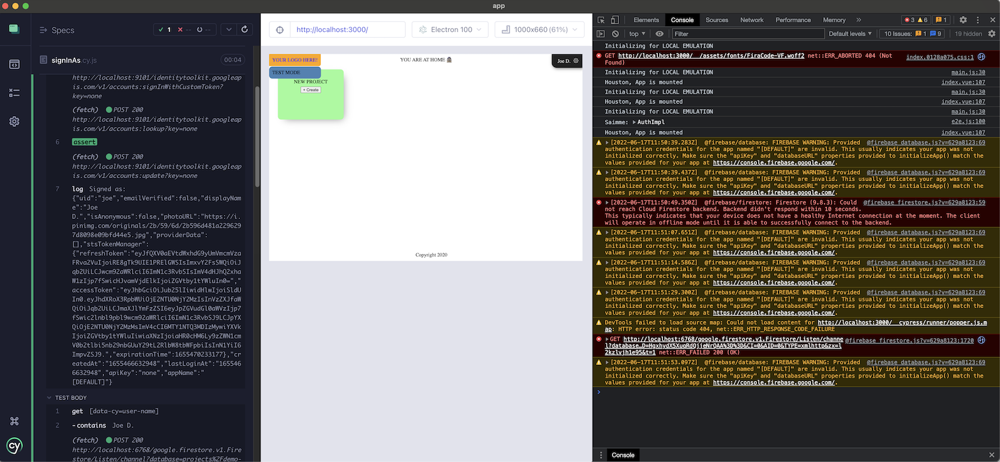

# App

Web application sample project.

## Requirements

- `npm` >= 7.7.0
- Docker Desktop

   >For Mac and Windows, Docker Compose comes as part of Docker Desktop. For Linux, see [Install Compose on Linux systems](https://docs.docker.com/compose/install/#install-compose-on-linux-systems).

### Cypress setup

Cypress is brought in via `npm`, but in order to use it as a desktop application (which it is), please take the following steps:

<details><summary><b>macOS</b></summary>

After `npm install`:

```
$ npx cypress open
```

This opens Cypress for the first time. 

Move the icon to your favourite location and right click > `Options` > `Keep in Dock`.

This helps you launch the tool as a desktop application, in the future.
</details>

<details><summary><b>Linux</b></summary>

As per the Cypress [installation instructions](https://docs.cypress.io/guides/getting-started/installing-cypress#Linux):

```
$ sudo apt-get update
$ sudo apt-get install libgtk2.0-0 libgtk-3-0 libgbm-dev libnotify-dev libgconf-2-4 libnss3 libxss1 libasound2 libxtst6 xauth xvfb
```

That's all. You'll be using the Cypress version installed via `npm`. Launch it with `npx cypress open` after the install.
</details>

<details><summary><b>Windows 10 + WSL2</b></summary>

>*Within 2021, Microsoft is bringing the [WSLg](https://devblogs.microsoft.com/commandline/the-initial-preview-of-gui-app-support-is-now-available-for-the-windows-subsystem-for-linux-2/) to Windows 10. This will allow us to launch the Linux-side Cypress GUI, and use it from Windows. 🎉🎉🥁*

Windows and WSL2 duo is not a supported Cypress platform. This means you will need to do a little bit more than the other OSes. In short, you'll use *one* Cypress via `npm`, within WSL2, for "headless" testing (`npm test`).

For test based development, we recommend installing *another* instance, this time on the Windows side.

- Within WSL2, follow the above instructions for Linux. This prepares the headless Cypress.
- Within Windows, follow the [direct download](https://docs.cypress.io/guides/getting-started/installing-cypress#Direct-download) (desktop install) guide
   - Download `cypress.zip` 
   - Extract it at a temporary location
   - Move the resulting folder into a suitable place (eg. under your user's folder), from where you'll launch the application.

   Note that Cypress does not install as a normal Windows program, and it does not show in the `Start` menu. To uninstall Cypress, just trash the whole folder it's in.

Try launching the `Cypress.exe` app.
</details>


<!--
Development is done with: 

- macOS 11.5
- node 16.5
- npm 7.19
- Docker Desktop 3.5.2
-->

## Getting started

```
$ npm install
```

>Note: This will take *ages* on the first time, since it's loading not only the `npm` dependencies but a ~600MB Cypress binary, as well.
>
>If you don't need Cypress (yet), `CYPRESS_INSTALL_BINARY=0 npm install` speeds up the install by skipping downloading the binary part.

Launch the app:

```
$ npm run dev
...
[vite_1]   vite v2.4.4 dev server running at:
[vite_1]
[vite_1]   > Local:    http://localhost:3000/
[vite_1]   > Network:	 ...
[vite_1]
...
```

This serves the UI locally, against an emulated Firebase back-end.

>Within local mode, you sign in by `?user=dev` query parameter (even though the social sign-in button is visible - it might not work). 

Try it:

[http://localhost:3000?user=dev](http://localhost:3000?user=dev)

Try making some changes in the `src/**` files (`src/pages/Home/index.vue` has the main page) and see that they are reflected in the browser.


## Two development workflows

The above command started a local, emulated version of Firebase. You can also start it with `npm run dev:local`.

The other way is `npm run dev:online`. This works against your cloud Firebase project. We'll come to it shortly.

Differences of these modes:

||Back-end|Data|Users|Authentication|Central logging|
|---|---|---|---|---|---|
|`local`|emulated|primed from `local/docs.js`, at each launch|primed from `local/users.js`|with `&user=<id>`|browser console|
|`online`|in the cloud|in the cloud; changes are persistent|←|←|command line|

>**Note:** Tests (`npm test`) also use local mode but bring their own data and users. You can keep `npm run dev` running, and use it both for browser development and running Cypress tests. The two use different Firebase projects so their data and users won't overlap.

<!-- Note on "online" mode's central logging:

This sub-package is not operations aware, and thus we'll likely not roll the central logs onto the cloud in the way `app-deploy-ops` does.

We *could* log to the Firebase staging project's Cloud Functions log, rather easily. Is there a benefit in doing so, vs. the local command line?

This is something of a hazy area - give feedback if you have practical suggestions.
-->


### `dev:local`

Use this mode when:

- you are developing back-end features (Firestore security rules, Cloud Functions) and want to test that they work with the front-end. <font color=gray>*[instructions later in this doc]*</font>
- you want to start with primed data and users, each time, instead of persisting the changes
- you want to skip the sign-in dialog, to speed up development a few clicks
- you don't have a Firebase account, yet

With local mode, you can test back-end features while developing them, and only deploy working back-end stuff.

#### Launch

Let's see a bit in detail, what happens when you start the app:

```
$ npm run dev

> dev
> npm run dev:local

> predev:local
> port-is-free 3000,5002 && npm run --silent _genEnvLocal

...
> dev:local
> concurrently --kill-others-on-fail -n emul,init "npm run --silent _dev_local_emul" "npm run -s _dev_local_init && npm run -s _dev_local_vite"

[emul] Launching Docker... 🐳
[emul] 
```

We launch Docker for running the Firebase Emulators.

```
...
[emul] ⚠  emulators: You are not currently authenticated so some features may not work correctly. Please run firebase login to authenticate the CLI.
[emul] i  emulators: Starting emulators: auth, functions, firestore
[emul] ⚠  functions: The following emulators are not running, calls to these services from the Functions emulator will affect production: database, hosting, pubsub, storage
[emul] ⚠  Your requested "node" version "14 || ^16" doesn't match your global version "16"
[emul] ⚠  functions: You are not signed in to the Firebase CLI. If you have authorized this machine using gcloud application-default credentials those may be discovered and used to access production services.
[emul] ⚠  functions: Unable to fetch project Admin SDK configuration, Admin SDK behavior in Cloud Functions emulator may be incorrect.
[emul] i  firestore: Firestore Emulator logging to firestore-debug.log
[emul] i  ui: Emulator UI logging to ui-debug.log
[emul] i  functions: Watching "/work/functions" for Cloud Functions...
[emul] ✔  functions[cloudLoggingProxy_v0]: http function initialized (http://0.0.0.0:5002/app/us-central1/cloudLoggingProxy_v0).
[emul] ✔  functions[userInfoShadow_2]: firestore function initialized.
[emul] 
[emul] ┌─────────────────────────────────────────────────────────────┐
[emul] │ ✔  All emulators ready! It is now safe to connect your app. │
[emul] │ i  View Emulator UI at http://0.0.0.0:4000                  │
[emul] └─────────────────────────────────────────────────────────────┘
[emul] 
[emul] ┌────────────────┬──────────────┬───────────────────────────────┐
[emul] │ Emulator       │ Host:Port    │ View in Emulator UI           │
[emul] ├────────────────┼──────────────┼───────────────────────────────┤
[emul] │ Authentication │ 0.0.0.0:9100 │ http://0.0.0.0:4000/auth      │
[emul] ├────────────────┼──────────────┼───────────────────────────────┤
[emul] │ Functions      │ 0.0.0.0:5002 │ http://0.0.0.0:4000/functions │
[emul] ├────────────────┼──────────────┼───────────────────────────────┤
[emul] │ Firestore      │ 0.0.0.0:6767 │ http://0.0.0.0:4000/firestore │
[emul] └────────────────┴──────────────┴───────────────────────────────┘
[emul]   Emulator Hub running at localhost:4400
[emul]   Other reserved ports: 4500
...
```

The emulators are started in the background. The `wait-for` tool waits for them to be up and then launches a script that primes the emulated Firestore instance with data and local users:

```
[init] Creating... { uid: 'dev', displayName: 'Just Me' }
```

The command then proceeds to serve the files, using Vite:

```
[init]   vite v2.3.7 dev server running at:
[init] 
[init]   > Local: http://localhost:3000/
[init]   > Network: use `--host` to expose
[init] 
[init]   ready in 1072ms.
[init] 
...
```

The data used for priming is located in `local/docs.js`. Users created are in `local/users.js`. You can customize these to your/your team's liking.

Remember that ANY CHANGES TO THE DATA are lost when you close the emulator (with Ctrl-C). Use that as a feature...

>Note: You can use this way of launching for *both* the app and the backend; the other way doesn't cut it.


### `dev:online`

With "online" development, you run against the Firebase back-end services, but still have hot-module-reload to help in developing the UI.

Use this when:

- the back-end is stable, and you are working on UI features
- the back-end is deployed
- you don't mind actually changing data
- you have a Firebase account
- you want to sign in as a real user

The mode needs `firebase.staging.js` (in the project's root), to find the staging project. Instructions for creating it are in the root `README`.

#### Launch! 🚀

Launch the server:
  
```
$ npm run dev:online
...
```

Point your browser to `http://localhost:3001`.

Changes to your front-end files are still reflected in the browser, but back-end services are now run in the cloud. Changes you do to the data will persist. Traffic you create will be using your [quotas](https://firebase.google.com/docs/functions/quotas).

The two development modes are completely orthogonal - you can run them side by side, in different terminals. By default, local uses port 3000 and online port 3001.


### When to use which mode?

Just try, which suits your way. :)

As mentioned above, if you work on UI features only, `dev:online` may be better.

If you work on removing data, `dev:local` may suit best, since it always boots from a known-good data set (and users).

You can customize the `local/*` setup to your development needs. Tests carry their own data and users, so they are safe from your changes.

Before we look at tests, a brief mention on linting.


## Linting

```
$ npm run lint
...
```

This gives you warnings that you may or may not wish to fix. Steer them at `.eslintrc.cjs`.

>Note: At the moment (Apr 2021) we're not focused on reducing the number of lint warnings (or even errors).

With the sample app, there may be warnings but there should not be errors.


## Testing

You can use Cypress for test based development as well as running all the tests, from command line.

Make sure you have followed the instructions in the "Requirements" section, concerning Cypress desktop application.


### Running all the tests

```
$ npm test
```

`npm test` launches the same local server as `npm run dev`, and runs Cypress tests on it.


### Test based development

The other way is to keep `npm run dev` running, and edit both one's code and tests (and Security Rules) while keeping an eye on the test results.

Have `npm run dev` running in the background. 

Launch Cypress and pick the `packages/app` subfolder.


Try to run the tests.



As you can see in the image, always keep the developer tools open while running Cypress tests. It helps.

Now edit some test in the IDE (they are under `cypress/anonymous` and `cypress/joe`).

>**Disclaimer:** 
>
>After long retaining to the Cypress convention of `cypress/integration`, the author changed the folder structure to reflect the various user stories a front end might have. Thus, within `cypress` folder, tests for a certain user story are in their own folder. Naturally, you may set this back to Cypress defaults if you wish. Also, `cypress/support` was renamed to `commands` since it's where custom commands come from.

Cypress will automatically re-run tests while you make changes to the source - or the tests. A big display becomes useful, here!

In short, you can:

- *time travel* to see what the UI looked, at the time the tests were executed.

The Cypress approach changes the way we do software. The more time you spend with it, the more time it likely will save you.


#### Note

Some Cypress features like "stubs" and "proxies" are not need, at all. Those are intended for building scaffolding when running things locally, but we have the whole Firebase emulators so we can work against the Real Thing.


## Production build

```
$ npm run build
...
vite v2.3.8 building for production...
✓ 55 modules transformed.
dist/aside-keys.js   17.91kb / brotli: 5.64kb
dist/aside-keys.js.map 28.60kb
dist/style.css       5.26kb / brotli: 1.43kb
dist/app.es.js       33.24kb / brotli: 8.14kb
dist/app.es.js.map   65.48kb
dist/vue-router.js   52.54kb / brotli: 11.63kb
dist/vue-router.js.map 172.74kb
dist/vue.js          132.61kb / brotli: 26.22kb
dist/vue.js.map      512.57kb
```

This builds your front end application in `dist/` folder. It contains all the logic and the styles that your application has, but it lacks the operational awareness that makes it fully ready for production.

We'll add that layer around it in the final sub-package, `../app-deploy-ops`.


## Maintenance

Cypress binaries are gathered in [a cache directory](https://docs.cypress.io/guides/getting-started/installing-cypress#Binary-cache). You might want to clean the earlier ones away, at times, to save disk space.
