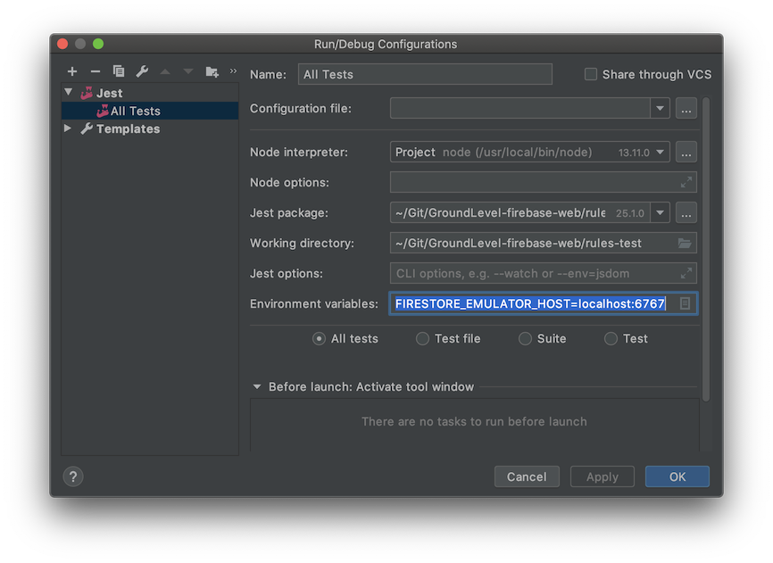

# Developer notes

## WebStorm shared run configurations

If you are using the WebStorm IDE, you should have a shared run configurations (`../.idea/runConfigurations`). This allows you to run the tests from the IDE, and/or debug them.


Launch the Firebase emulator in the background, by `npm run start`.


## Debugging in WebStorm IDE

In IntelliJ WebStorm, create a Run configuration by `Run` > `Edit Configurations...`:



><font color=red>Note: Details in the screenshot are aged. Check `package.json` for the right input.</font>

You can set breakpoints in the UI or use the `debugger` statement to bring up the IDE. 

Start a debugging run of the tests from the `Debug > Run All tests` icon


## Seeing relevant `firestore.rules` line

When a test fails, there's a "L15" or similar mention:

>

Use this to pinpoint the rule that caused the unexpected behaviour.


## WARNING: Firestore emulator does *not* change the rules

If you edit `firestore.rules`, you'll see this on the console

```
...
[emul] i  firestore: Change detected, updating rules...
[emul] ✔  firestore: Rules updated.
...
```

One would expect the rules are changed. DO NOT TRUST IT. At least `firebase-tools` version 8.12.0 happily carries on with the old rules.

Always Ctrl-C + `npm run start`, to have rule changes actually applied.

( This is obviously a bug. If you wish to `#help`, please inform Firebase about it.. ;) )


## WARNING: Use of dates in `docs.js`

Firebase Web client can take JavaScript `Date` objects and convert them to its `Timestamp` automatically. However, `Date.now()` and `Date.parse` do <u>not</u> produce Date objects but Unix epoch numbers, so be warned.

||Use|
|---|---|
|Current time|`new Date()`|
|Specific time|`new Date('27 Mar 2020 14:17:00 EET')`|

*Note: We could detect these automatically by read validation in the access rules (not assuming existing data complies with the schema). That turned out to be non-trivial, so just be careful.*


## Debugging Cloud Function deployment failures

If a deploy fails, and the local CLI does not give proper details, try:

Firebase Console > project > `Functions` > `Logs`

>

This was enough detail to fix it.

