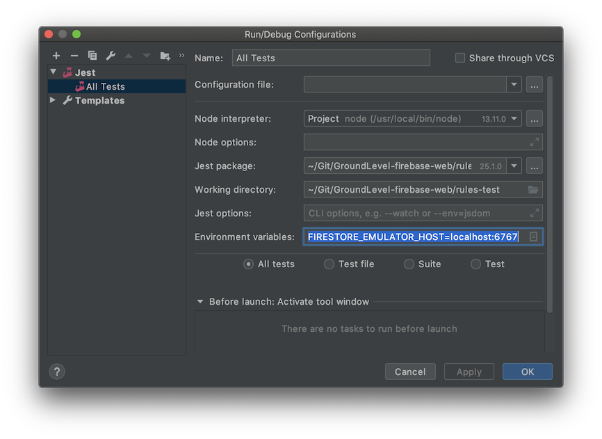

# Developer notes

## WebStorm shared run configurations

If you are using the WebStorm IDE, you should have a shared run configurations (`../.idea/runConfigurations`). This allows you to run the tests from the IDE, and/or debug them.

Launch the Firebase emulator in the background, by `npm run start`.

## Debugging in WebStorm IDE

In IntelliJ WebStorm, create a Run configuration by `Run` > `Edit Configurations...`:

>Note: Details in the screenshot are aged. Check `package.json` for the right input.

You can set breakpoints in the UI or use the `debugger` statement to bring up the IDE. 

Start a debugging run of the tests from the `Debug > Run All tests` icon

## Seeing relevant `firestore.rules` line

When a test fails, there's a "L15" or similar mention:

>

Use this to pinpoint the rule that caused the unexpected behaviour.

-- 

*Edit*: We've given Firebase the [idea](https://github.com/firebase/firebase-js-sdk/issues/4793) of attaching also possible `debug` output here.

## WARNING: Use of dates in `docs.js`

Firebase Web client can take JavaScript `Date` objects and convert them to its `Timestamp` automatically. However, `Date.now()` and `Date.parse` do <u>not</u> produce Date objects but Unix epoch numbers, so be warned.

||Use|
|---|---|
|Current time|`new Date()`|
|Specific time|`new Date('27 Mar 2020 14:17:00 EET')`|

*Note: We could detect these automatically by read validation in the access rules (not assuming existing data complies with the schema). That turned out to be non-trivial, so just be careful.*
