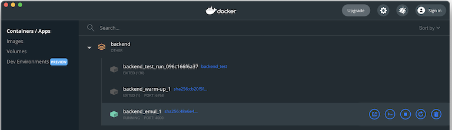

# Using Docker Compose 2.0

Docker Compose (DC for short) is a wonderful tool. However, it will need some adjustment from you, if you've so far been used to `npm` centric workflows - called "native" in this repo.

We are not going to details of DC here (read it elsewhere), but giving practical notes that aren't necessarily obvious from reading the manuals.

## `docker compose up`

You can use this command to separately launch the emulator.

This is useful to be able to see the terminal output from the emulator. 

>If that container is launched indirectly (via `docker compose run` dependencies), its output is hidden from the terminal. See below for how to see it.

## `docker compose run`

This runs a certain task, found in the `docker-compose.yml` file.

Be aware that the dependent services launched by such a task **remain running even after the task has finished**. This means two things:

- your subsequent runs are faster, since the background systems are already up and running
- the ports taken up by those services (and mapped to the Docker host, ie. your `localhost`) **remain taken** until you close the composed stack.

To close the composed stack:

```
$ docker compose down
```

>Note: Sometimes `down` doesn't cut it. If this happens, you need to try:
>
>- switching off and on your system (...just kidding, ...kinda)
>- Docker > Restart
>- Docker > Dashboard > Containers > `backend` > Delete


## `docker compose build`

If you change the build instructions under `../../dc-tools/`, run these on all affected DC services:

```
$ docker compose build --no-cache warm-up
```

Note the `--no-cache`.


## Console output per container

You can *always* see any container's console output in the Docker Dashboard > `Containers / Apps` > `backend` > `backend_emul_1`



Click the container to see its logs.

