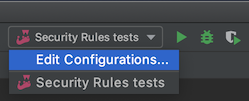
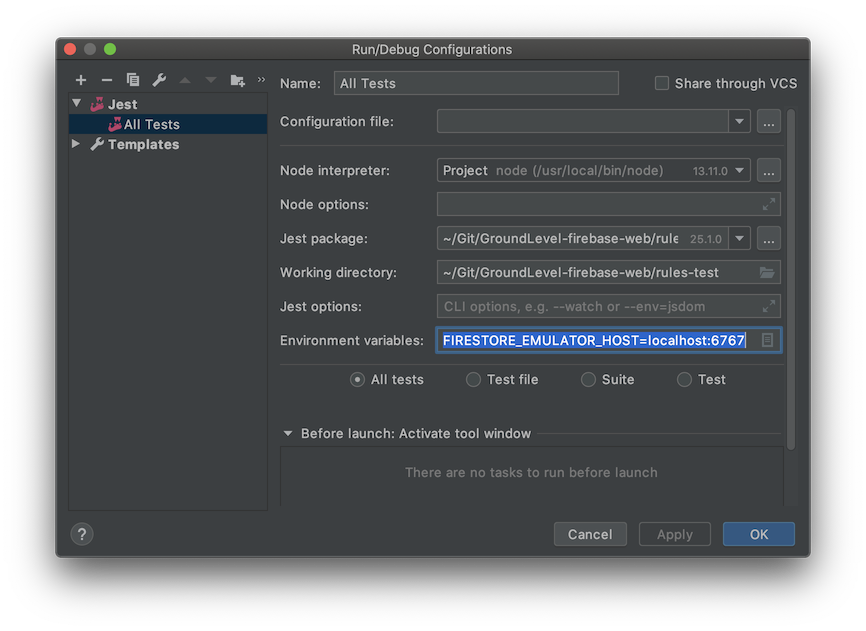
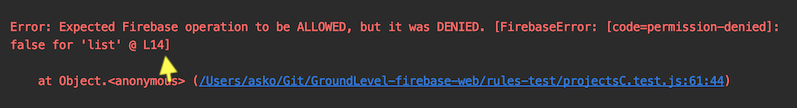

# Developer notes

## WebStorm shared run configurations

If you are using the WebStorm IDE, you should have a shared run configurations (`../.idea/runConfigurations`). This allows you to run the tests from the IDE, and/or debug them.

Launch the Firebase emulator in the background, by `npm run start`.

## Debugging in WebStorm IDE

In IntelliJ WebStorm, create a Run configuration by `Run` > `Edit Configurations...`:

>Note: Details in the screenshot are aged. Check `package.json` for the right input.

You can set breakpoints in the UI or use the `debugger` statement to bring up the IDE. 

Start a debugging run of the tests from the `Debug > Run All tests` icon

## Seeing relevant `firestore.rules` line

When a test fails, there's a "L15" or similar mention:

>

Use this to pinpoint the rule that caused the unexpected behaviour.

-- 

*Edit*: We've given Firebase the [idea](https://github.com/firebase/firebase-js-sdk/issues/4793) of attaching also possible `debug` output here.

## WARNING: Use of dates in `docs.js`

Firebase Web client can take JavaScript `Date` objects and convert them to its `Timestamp` automatically. However, `Date.now()` and `Date.parse` do <u>not</u> produce Date objects but Unix epoch numbers, so be warned.

||Use|
|---|---|
|Current time|`new Date()`|
|Specific time|`new Date('27 Mar 2020 14:17:00 EET')`|

*Note: We could detect these automatically by read validation in the access rules (not assuming existing data complies with the schema). That turned out to be non-trivial, so just be careful.*

## Firebase `--project` affects Cloud Functions

Only the project mentioned in the launch command gets Cloud Functions applied. The rest don't.

One can use eg. Firestore with any number of projects, on the same emulator instance but Cloud Functions background logic is only connected to the project named at the launch command.

>This behaviour isn't documented by Firebase. In fact, the author remembers seeing somewhere that the `--project` flag would "only affect hosting", but this is unconfirmed, without a source link.
