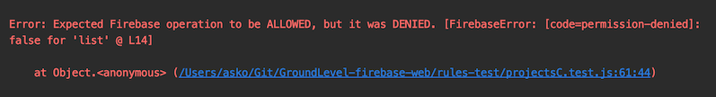

# Debugging

## WebStorm

In IntelliJ WebStorm, create a Run configuration by `Run` > `Edit Configurations...`:


Add the `FIRESTORE_EMULATION_HOST` environment variable, as it is in `package.json`.

You can now set breakpoints in the UI or use the `debugger` statement to bring up the IDE. 

Start a debugging run of the tests from the `Debug > Run All tests` icon


## Seeing relevant `firestore.rules` line

When a test fails, there's a "L15" or similar mention:

>

Use this to pinpoint the rule that caused the unexpected behaviour.


## YOU NEED TO RESTART the Emulator

The Firebase emulator (Mar 2020; version 7 or 8.0) does not detect changes to the rules file. If you edit the rules, restart the emulator.

This provides a case for using the simpler `npm test` target that runs the emulator separately, each time, for each test.


## Run just one `describe` blcok

To be enjoyed while `firebase emulators:start --only firestore` is running.

```
$ npx jest -f invitesC.test.js -t "'/invited' rules"
...
```

Without the `-f` also the other test files would get compiled. With this, they don't even need to be valid JavaScript.

It's a bit cryptic, but works. Copy paste the description of the `describe` block from your code.

>Note: `describe.only` seems to be worth nothing. (would prefer using it)

